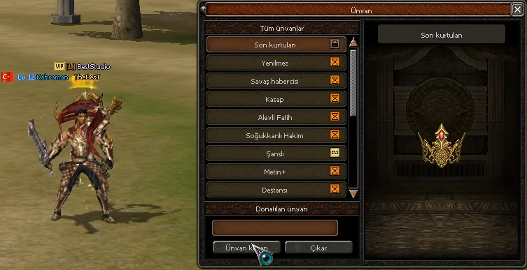

# Official Title System

## Resmi Ünvan Başlık Sistemi



Bu paket, Metin2 için hazırlanmış **Resmi Ünvan Başlık Sistemi** exportudur. Sistem `__TITLE_SYSTEM__` ve `ENABLE_TITLE_SYSTEM` define yapısı üzerinden ayrıştırılmıştır.

Ünvan sistemi; oyuncunun kazandığı ünvanları listelemesi, süreli veya kalıcı ünvanları kuşanması, kuşanılan ünvanın karakterin baş üstünde efekt / nameplate / sprite olarak diğer oyunculara da görünmesi ve sertifika itemleri ile yeni ünvan açılması üzerine kuruludur.

Bu export sadece Python UI değildir. Client source (efekt, particle, render target, text tail, packet), server game (manager, packet, GM komutu, DB akışı), pack Python, uiscript, 16 dil locale verisi, UI/efekt assetleri, item proto satırları ve SQL dosyası birlikte çalışır.

## Klasör Yapısı

```txt
Official Title System
├─ 01. Svn
│  ├─ Client
│  │  ├─ EffectLib
│  │  ├─ EterLib
│  │  ├─ GameLib
│  │  └─ UserInterface
│  ├─ Server
│  │  ├─ common
│  │  ├─ db
│  │  └─ game
│  └─ Tools
│     └─ dump_proto
├─ 02. Client
│  ├─ d
│  │  └─ ymir work
│  │     ├─ effect/etc/title
│  │     └─ ui/game/title
│  ├─ icon
│  ├─ locale
│  │  └─ locale
│  │     ├─ common
│  │     └─ ae, cz, de, dk, en, es, fr, gr, hu, it, nl, pl, pt, ro, ru, tr
│  ├─ root
│  └─ uiscript
├─ 03. Server
│  ├─ mysql
│  │  └─ player
│  └─ share
│     └─ conf
├─ Added
│  ├─ 01. Svn
│  ├─ 02. Client
│  └─ 03. Server
├─ official-title-system.png
└─ README.md
```

Paket şu anki güncel haliyle `507` dosyadan oluşuyor.

## Sistem Mimarisi

Server tarafındaki ana sınıf:

```txt
CTitleSystemManager
```

Bu manager ünvan proto tablosunu yükler, oyuncunun sahip olduğu ünvanları `player_title` tablosundan okur, süre dolumu ve 1 saat kala uyarı kontrolünü yapar, kuşanma / çıkarma akışını yönetir ve kuşanılan ünvanın görselini `SpecificEffectPacket` ile çevredeki oyunculara yayınlar.

Client source tarafındaki ana parçalar:

```txt
CPythonTitleSystem
CPythonNetworkStream
CPythonTextTail
CInstanceBase
CEffectManager / CParticleSystemInstance / CParticleInstance
CRenderTargetManager
```

Bu parçalar Python UI ile client binary arasındaki köprüyü kurar. `titleSystem` modülü, ünvan tablosu, oyuncu ünvan listesi, sprite / nameplate görselleri, render target üzerinde çalışan önizleme paneli ve baş üstü efekt yerleşimi bu katmanda bulunur.

Pack tarafındaki ana pencere:

```txt
02. Client/root/uicharactertitle.py
02. Client/uiscript/charactertitlewindow.py
```

Bu pencere ünvan listesini, kuşanılan ünvanı, önizleme modelini, kilit/süre durumlarını, tooltipleri ve kuşan/çıkar akışını yönetir.

## Define Bilgisi

Server:

```cpp
#define __TITLE_SYSTEM__
```

Client:

```cpp
#define ENABLE_TITLE_SYSTEM
```

Sistem tek define ile açılır, zincirli alt define'ı yoktur. Ancak client tarafında **`RENDER_TARGET`** define'ı zorunlu bir ön koşuldur: ünvan penceresindeki 3D/efekt önizleme paneli render target üzerine çizilir.

```cpp
#if defined(ENABLE_TITLE_SYSTEM) && defined(RENDER_TARGET)
```

`RENDER_TARGET` yoksa `uiscript/charactertitlewindow.py` içindeki `model_render_target` widget'ı ve `ui.py` içindeki `RenderTarget` sınıfı çalışmaz.

## Bağlı Parçalar

Bu sistemin tam çalışması için aşağıdaki parçalar birlikte bulunmalıdır:

```txt
Packet sistemi        -> HEADER_CG_TITLE_SYSTEM / HEADER_GC_TITLE_SYSTEM
Item proto sistemi    -> ITEM_USE / USE_TITLE subtype
DB tablosu            -> player.player_title
Server manager        -> title_system.cpp / title_system.h
GM komutu             -> /title_system
Specific effect akışı -> "efekt_yolu|title_index" formatlı SpecificEffectPacket
Client bindingleri    -> titleSystem, app, item ve net tarafındaki fonksiyonlar
Render target         -> RENDER_TARGET_INDEX_TITLE
Text tail             -> nameplate / sprite ünvan çizimi
Pack UI               -> uicharactertitle.py, charactertitlewindow.py, karakter penceresi bağlantısı
Locale                -> title_gf.txt, title_wz.txt, title_resource_list.txt, TITLE_SYSTEM_* anahtarları
Assetler              -> ui/game/title ve effect/etc/title klasörleri
DumpProto parser      -> USE_TITLE proto çevirimi
```

## 01. Svn

`01. Svn` klasörü source entegrasyonu içindir.

### Client Source

```txt
01. Svn/Client/EffectLib/EffectInstance.cpp
01. Svn/Client/EffectLib/EffectManager.cpp
01. Svn/Client/EffectLib/ParticleInstance.cpp
01. Svn/Client/EffectLib/ParticleSystemInstance.cpp
01. Svn/Client/EffectLib/ParticleSystemInstance.h
01. Svn/Client/EterLib/RenderTargetManager.h
01. Svn/Client/GameLib/ActorInstance.h
01. Svn/Client/GameLib/ActorInstanceAttach.cpp
01. Svn/Client/GameLib/ItemData.cpp
01. Svn/Client/GameLib/ItemData.h
01. Svn/Client/UserInterface/InstanceBase.cpp
01. Svn/Client/UserInterface/InstanceBase.h
01. Svn/Client/UserInterface/InstanceBaseEffect.cpp
01. Svn/Client/UserInterface/Locale_inc.h
01. Svn/Client/UserInterface/Packet.h
01. Svn/Client/UserInterface/PythonApplication.cpp
01. Svn/Client/UserInterface/PythonApplication.h
01. Svn/Client/UserInterface/PythonApplicationEvent.cpp
01. Svn/Client/UserInterface/PythonApplicationModule.cpp
01. Svn/Client/UserInterface/PythonItemModule.cpp
01. Svn/Client/UserInterface/PythonNetworkStream.cpp
01. Svn/Client/UserInterface/PythonNetworkStream.h
01. Svn/Client/UserInterface/PythonNetworkStreamPhaseGame.cpp
01. Svn/Client/UserInterface/PythonNetworkStreamPhaseGameItem.cpp
01. Svn/Client/UserInterface/PythonTextTail.cpp
01. Svn/Client/UserInterface/PythonTextTail.h
01. Svn/Client/UserInterface/PythonTitleSystem.cpp
01. Svn/Client/UserInterface/PythonTitleSystem.h
01. Svn/Client/UserInterface/StdAfx.h
01. Svn/Client/UserInterface/UserInterface.cpp
01. Svn/Client/UserInterface/UserInterfaceProject.md
```

`PythonTitleSystem.cpp` ve `PythonTitleSystem.h` yeni dosyalardır. Visual Studio kullanan source'larda bu dosyalar `UserInterface` projesine eklenmelidir. Gerekli proje notları `UserInterfaceProject.md` içinde bulunur.

`EffectLib` ve `GameLib` değişiklikleri iki iş yapar:

- Baş üstü ünvan efektinin kamera mesafesine göre ölçeklenmesi (`SetAttachingEffectTranslation`, `SetParticleScale`, `RefreshActiveParticleScale`).
- Ünvan penceresindeki önizleme efektinin sahnede iki kez çizilmemesi ve frustum dışında kesilmemesi (`TITLE_UI_PREVIEW_EFFECT_INSTANCE`, `SetForceRenderWithoutFrustum`).

Bu bloklar `#else` dalı ile eski davranışı koruyacak şekilde yazılmıştır; define kapalıyken client davranışı değişmez.

### Server Source

```txt
01. Svn/Server/common/item_length.h
01. Svn/Server/common/service.h
01. Svn/Server/db/ProtoReader.cpp
01. Svn/Server/game/char.cpp
01. Svn/Server/game/char_item.cpp
01. Svn/Server/game/char_manager.cpp
01. Svn/Server/game/cmd.cpp
01. Svn/Server/game/cmd_gm.cpp
01. Svn/Server/game/input.h
01. Svn/Server/game/input_db.cpp
01. Svn/Server/game/input_main.cpp
01. Svn/Server/game/main.cpp
01. Svn/Server/game/packet.h
01. Svn/Server/game/packet_info.cpp
01. Svn/Server/game/title_system.cpp
01. Svn/Server/game/title_system.h
01. Svn/Server/game/Makefile.md
```

`title_system.cpp` ve `title_system.h` yeni server game dosyalarıdır. FreeBSD/Makefile kullanan yapılarda `title_system.cpp` build listesine eklenmelidir. Windows proje kullanan yapılarda `game.vcxproj` içine dahil edilmelidir. Detaylar `Makefile.md` içinde.

### DumpProto

```txt
01. Svn/Tools/dump_proto/ItemCSVReader.cpp
```

Sertifika itemleri `ITEM_USE / USE_TITLE` subtype kullandığı için DumpProto tarafı da güncellenmelidir. Aksi halde `item_proto` üretilirken `USE_TITLE` satırı tanınmaz.

`ItemCSVReader.cpp` içinde bulunması gereken kritik kayıt:

```txt
USE_TITLE
```

Bu kayıt eklendikten sonra DumpProto yeniden derlenmeli ve `item_proto` çıktıları tekrar üretilmelidir.

## 02. Client

`02. Client` klasörü pack tarafı için hazırlanmıştır.

### Root ve UI Script

```txt
02. Client/root/game.py
02. Client/root/interfacemodule.py
02. Client/root/ui.py
02. Client/root/uicharacter.py
02. Client/root/uicharactertitle.py
02. Client/root/uiinventory.py
02. Client/root/uitooltip.py
02. Client/uiscript/charactertitlewindow.py
02. Client/uiscript/characterwindow.py
02. Client/uiscript/gameoptionwindow_game.py
```

`uicharactertitle.py` ve `charactertitlewindow.py` yeni dosyalardır, komple kopyalanır. Diğerleri mevcut dosyalara eklenecek bloklardır.

Pencere karakter penceresindeki portre butonundan açılır: `characterwindow.py` içine eklenen `Face_Button` ve `Write_Image` widget'ları `uicharacter.py` içindeki `__ToggleTitleSystemWindow` fonksiyonunu tetikler.

`gameoptionwindow_game.py` içindeki `show_player_title_button`, diğer oyuncuların ünvanlarının gösterilip gösterilmeyeceğini ayarlar.

`uiinventory.py` ve `uitooltip.py` sertifika itemleri (57000-57002) içindir: kullanım onay diyaloğu ve ünvan süresi tooltipi.

### Görseller, Efektler ve İkonlar

```txt
02. Client/d/ymir work/ui/game/title/window        -> pencere chrome (18 dosya)
02. Client/d/ymir work/ui/game/title/titles        -> ünvan görselleri + sprites_1000/1001/1002 (138 dosya)
02. Client/d/ymir work/ui/game/windows             -> char_face_* portre butonu (5 dosya)
02. Client/d/ymir work/effect/etc/title            -> ünvan efektleri, 10 .mse + 74 .dds
02. Client/icon/icon/item                          -> 57000, 57001, 57002 sertifika ikonları
```

Toplam 248 asset dosyası. Pack yapın farklıysa bu içerikler kendi `d`, `icon` ve ilgili UI packlerine göre taşınmalıdır.

### Locale ve Ünvan Verisi

```txt
02. Client/locale/locale/common/title_resource_list.txt   -> resource index -> .sub eşlemesi (komple dosya)
02. Client/locale/locale/common/item_list.txt             -> 57000-57002 ikon satırları
02. Client/locale/locale/<dil>/title_gf.txt               -> global ünvan tablosu (komple dosya)
02. Client/locale/locale/<dil>/title_wz.txt               -> sunucu/sıralama ünvan tablosu (komple dosya)
02. Client/locale/locale/<dil>/locale_game.txt            -> TITLE_SYSTEM_* mesaj anahtarları
02. Client/locale/locale/<dil>/locale_interface.txt       -> TITLE_SYSTEM_UI_* ve GAME_OPTION_PLAYER_TITLE
```

Diller: `ae, cz, de, dk, en, es, fr, gr, hu, it, nl, pl, pt, ro, ru, tr`

`title_gf.txt` ve `title_wz.txt` yeni dosyalardır, komple kopyalanır. `locale_game.txt` ve `locale_interface.txt` dosyaları **komple dosya değildir**, sadece eklenecek satırları içerir; mevcut locale dosyalarının üzerine kör şekilde yazılmamalıdır.

`title_gf.txt` sütun düzeni:

```txt
index | resource_index | type | isim | kosul | aciklama | acilis_tarihi | flag
```

`title_wz.txt` sütun düzeni:

```txt
index | resource_index | type | isim | kosul | aciklama | 0 | 0 | sure_saniye | flag
```

## 03. Server

```txt
03. Server/mysql/player/player_title.sql
03. Server/share/conf/item_proto.txt
03. Server/share/conf/item_names.txt
```

`player_title.sql`, oyuncunun sahip olduğu ünvanları ve bitiş zamanlarını tutan tabloyu oluşturur:

```sql
CREATE TABLE IF NOT EXISTS `player_title` (
  `pid`         INT(10) UNSIGNED NOT NULL,
  `title_index` INT(10) UNSIGNED NOT NULL,
  `end_time`    INT(10) UNSIGNED NOT NULL DEFAULT 0,
  PRIMARY KEY (`pid`, `title_index`)
) ENGINE=InnoDB DEFAULT CHARSET=latin5;
```

Çok tablolu (`get_table_postfix`) yapılarda `player_title<postfix>` tabloları da açılmalıdır.

Kuşanılan ünvan bu tabloda tutulmaz; quest flag olarak saklanır:

```txt
title_system.active           -> kusanili unvan index'i
title_system.owned.<index>    -> sahiplik
title_system.expire.<index>   -> bitis timestamp'i
title_system.warn.<index>     -> 1 saat kala uyari verildi mi
title_system.cooldown         -> kusan/cikar spam korumasi
```

`item_proto.txt` ve `item_names.txt` dosyaları komple dosya değildir, sadece eklenecek sertifika item satırlarını içerir. Mevcut proto üretim yapın farklıysa bu satırlar direkt ezmek yerine mevcut tabloyla birleştirilmelidir.

Canlı sunucuda SQL uygulamadan önce `player` database yedeği alınmalıdır.

## Added Klasörü

`Added` klasörü, sistemi daha kolay kurmak için hazırlanmış hazır eklenmiş örnek dosyaları içerir.

```txt
Added/01. Svn      -> Source tarafında hazır entegre edilmiş örnek dosyalar
Added/02. Client   -> Client pack tarafında hazır eklenmiş örnek dosyalar
Added/03. Server   -> MySQL ve proto tarafında hazır dosyalar
```

Bu klasör özellikle karşılaştırma yapmak için kullanışlıdır. Kendi source yapın birebir aynı değilse dosyaları doğrudan ezmeden önce farkları kontrol etmek gerekir. Ana klasördeki `01. Svn`, `02. Client`, `03. Server` dosyaları ise sistemin ayrıştırılmış entegrasyon parçalarıdır.

## Packet Bilgisi

Client -> Game:

```txt
HEADER_CG_TITLE_SYSTEM = 185
TPacketCGTitleSystem { BYTE bHeader; BYTE bSubHeader; DWORD dwTitleIndex; }
```

Game -> Client:

```txt
HEADER_GC_TITLE_SYSTEM = 189   (DYNAMIC_SIZE_PACKET)
TPacketGCTitleSystem { BYTE bHeader; WORD wSize; BYTE bSubHeader; WORD wCount; }
```

CG subheader:

```txt
0 -> OPEN
1 -> EQUIP
2 -> UNEQUIP
```

GC subheader ve payload:

```txt
0 -> TABLE     -> wCount x TPacketGCTitleSystemTableRow
1 -> PLAYER    -> wCount x TPacketGCTitleSystemPlayerRow
2 -> EQUIPPED  -> 1 x TPacketGCTitleSystemEquipRow
3 -> NOTIFY    -> 1 x TPacketGCTitleSystemNotifyRow
4 -> END       -> payload yok
```

Notify mesajları:

```txt
0 ALREADY_GET     5 EQUIP_TITLE
1 WRONG_APPROACH  6 UNEQUIP_TITLE
2 WRONG_ITEM      7 ONE_HOUR_LEFT
3 END_TITLE       8 TRY_LATER
4 GET_TITLE       9 CHECK_UI
```

Bu packet header değerleri hedef source üzerinde doluysa çakışma çözülmeden sistem eklenmemelidir.

## Ünvan Görsel Tipleri

```txt
1 TEXT       -> sadece metin
2 IMAGE      -> tek görsel
3 EFFECT     -> baş üstü .mse efekti (SpecificEffectPacket ile yayınlanır)
4 NAMEPLATE  -> isim altı 3 parçalı görsel veya animasyonlu sprite
```

`1005`, `1006` ve `1011` ünvanları ekran uzayında nameplate olarak çizilir; bunlar için baş üstü efekt attach edilmez (`IsScreenSpaceTitleNameplate`).

## Ana Itemler

Sertifika itemleri:

```txt
57000 -> Kırmızı sertifika  -> ünvan 1001, 1002, 1003, 1004
57001 -> Mavi sertifika     -> ünvan 1000
57002 -> Yeşil sertifika    -> ünvan 1005, 1006
```

Sertifikanın hangi ünvanı vereceği item socket / value alanından okunur:

```txt
socket0 / value1 / value2 -> süre (saniye)
socket1 / value0          -> title_index
```

Bu vnumlar hedef serverda kullanılıyorsa sistem eklenmeden önce vnum çakışması çözülmelidir.

## Ünvan Listesi

Sıralama / etkinlik ünvanları (`title_wz.txt`):

```txt
1  -> Son kurtulan        (3 saat)
2  -> Yenilmez            (7 gün)
3  -> Savaş habercisi     (7 gün)
4  -> Kasap               (7 gün)
6  -> Alevli Fatih        (7 gün)
7  -> Soğukkanlı Hakim    (7 gün)
```

Global ünvanlar (`title_gf.txt`):

```txt
1000 -> Şanslı              1007 -> Nyx Şampiyonu
1001 -> Metin+              1008 -> Chione Şampiyonu
1002 -> Destansı            1009 -> Lodos Şampiyonu
1003 -> Efsanevi            1010 -> Fırtına Şampiyonu
1004 -> Mistik              1011 -> Okey Büyük Ustadı
1005 -> Güneşsever          1012 -> Jeton Avcısı
1006 -> Kutup Yıldızı
```

Ünvan proto tablosu server tarafında `title_system.cpp` içinde **statik dizi** olarak tutulur (`LoadProtoTable`). Yeni ünvan eklemek için bu diziye satır eklenmeli, ardından client locale dosyalarına (`title_gf.txt` / `title_wz.txt`) ve gerekiyorsa `title_resource_list.txt` içine karşılık gelen kayıt girilmelidir.

## Kurulum Özeti

1. Server `service.h` içine `__TITLE_SYSTEM__` define'ını ekle.
2. Client `Locale_inc.h` içine `ENABLE_TITLE_SYSTEM` define'ını ekle ve `RENDER_TARGET` desteğinin açık olduğunu doğrula.
3. `01. Svn/Server/common/item_length.h` içine `USE_TITLE` subtype'ını ekle.
4. `01. Svn/Server/game/title_system.cpp` ve `title_system.h` dosyalarını game source'a ekle.
5. Game build listesine `title_system.cpp` dosyasını ekle (`Makefile` ve/veya `game.vcxproj`).
6. Server tarafındaki `packet.h`, `packet_info.cpp`, `input.h`, `input_main.cpp`, `input_db.cpp`, `char.cpp`, `char_item.cpp`, `char_manager.cpp`, `cmd.cpp`, `cmd_gm.cpp`, `main.cpp` bağlantılarını uygula.
7. `01. Svn/Server/db/ProtoReader.cpp` içindeki `USE_TITLE` kaydını ekle.
8. Client source tarafında `PythonTitleSystem.cpp` ve `PythonTitleSystem.h` dosyalarını `UserInterface` projesine ekle.
9. Client packet, binding, item type, render target ve application module bağlantılarını uygula.
10. `EffectLib`, `GameLib`, `EterLib`, `InstanceBase` ve `PythonTextTail` bloklarını uygula.
11. `01. Svn/Tools/dump_proto` içindeki DumpProto parser değişikliğini ekle, DumpProto'yu yeniden derle ve `item_proto` çıktılarını tekrar üret.
12. `02. Client` içeriğini pack yapına göre ilgili `root`, `uiscript`, `locale`, `d` ve `icon` packlerine ekle.
13. `03. Server/mysql/player/player_title.sql` dosyasını DB tarafında uygula.
14. `03. Server/share/conf` içindeki sertifika item satırlarını mevcut proto/item tablonla birleştir.
15. Client binary, game server, db server ve packleri rebuild et.

## Test Akışı

```txt
1.  Client açılırken app.ENABLE_TITLE_SYSTEM 1 dönmeli.
2.  titleSystem modülü import edilmeli, uicharactertitle.py hata vermemeli.
3.  Karakter penceresindeki portre butonu ünvan penceresini açmalı.
4.  Login sonrası server SendOpen ile TABLE + PLAYER + EQUIPPED + END göndermeli.
5.  /title_system <unvan_no> ve /title_system <oyuncu> <unvan_adi> komutları çalışmalı.
6.  Kuşanılan ünvan baş üstünde görünmeli, diğer client'ta da görünmeli.
7.  Nameplate tipi ünvanlar (1005, 1006, 1011) isim altında çizilmeli, baş üstü efekt almamalı.
8.  Ünvan çıkarıldığında görsel anında temizlenmeli.
9.  Relog sonrası kuşanılı ünvan korunmalı.
10. Süreli ünvanda 1 saat kala TITLE_SYSTEM_MESSAGE_ONE_HOUR_LEFT gelmeli.
11. Süre dolunca ünvan listeden düşmeli ve player_title kaydı silinmeli.
12. 57000-57002 sertifikaları doğru isim, ikon ve USE_TITLE tipiyle görünmeli.
13. Yanlış sertifika/ünvan eşleşmesinde TITLE_SYSTEM_MESSAGE_WRONG_ITEM gelmeli.
14. Önizleme paneli efektli ünvanlarda efekti göstermeli, sahnede ikinci kopya çizmemeli.
15. Oyun ayarlarındaki "Ünvan" toggle'ı diğer oyuncuların ünvanını gizlemeli.
16. Hatalı packet testi: bilinmeyen subheader, sahip olunmayan title_index, süresi dolmuş
    title_index, hızlı ard arda equip/unequip (cooldown), 0 title_index.
```

## Dikkat Edilecek Noktalar

- Packet header değerleri (`185` / `189`) kendi source packet tablonla çakışmamalı.
- `HEADER_GC_TITLE_SYSTEM` client tarafında **`DYNAMIC_SIZE_PACKET`** olarak kaydedilmeli; `STATIC_SIZE_PACKET` yazılırsa TABLE paketinde desync olur.
- `RENDER_TARGET` define'ı kapalıysa önizleme paneli derlenmez; `charactertitlewindow.py` içindeki `model_render_target` widget'ını da kaldırman gerekir.
- `title_system.cpp` build listesine eklenmezse link aşamasında `CTitleSystemManager` için unresolved external hatası alınır.
- `PythonTitleSystem` client projesine eklenmezse Python tarafındaki `titleSystem` çağrıları çalışmaz.
- `USE_TITLE` hem `item_length.h` hem `ItemData.h` hem `ProtoReader.cpp` hem de DumpProto tarafında **aynı sıra numarasında** tanımlı olmalı; aksi halde proto subtype kayması olur.
- Ünvan proto tablosu server kodunda statik dizidir. Ünvan eklerken client `title_gf.txt` / `title_wz.txt` ile index ve resource eşleşmesini bozmayın.
- `title_system.cpp` içindeki `SendOpen` fonksiyonunda geliştirme sırasında bırakılmış bir `sys_err("TITLE_SYSTEM DEBUG: ...")` satırı vardır. Canlıya almadan önce bu satırı kaldırın, aksi halde her pencere açılışında syserr'e log basar.
- Locale ve item proto satırları komple dosya ezerek değil, mevcut yapıyla birleştirilerek uygulanmalı.
- Paket dosyaları GitHub için UTF-8 kaydedilmiştir. Kendi source ağacına alırken proje disiplinine göre `.cpp` / `.h` / `.py` dosyalarını Windows-1254 (BOM'suz), `.quest` / `.lua` dosyalarını ANSI olarak dönüştürün.
- Canlı SQL uygulamadan önce `player` database yedeği alınmalı.
- Added klasörü referanstır; farklı fork yapılarında doğrudan üstüne yazmak yerine diff alınmalıdır.

## İletişim

Hazırlayan marka: **Best Studio**

- GitHub: [github.com/ybeststudio](https://github.com/ybeststudio)
- Discord Server: [discord.gg/NXmc6JrwYr](https://discord.gg/NXmc6JrwYr)
- Discord ID: `beststudio`
- Web: [bestpro.dev](https://bestpro.dev)
- TurkMMO Forum: [Best Studio](https://forum.turkmmo.com/uye/2104546-best-studio/)
- YouTube: [@ybeststudio](https://www.youtube.com/@ybeststudiotr)
- Instagram: [@ybeststudio](https://www.instagram.com/ybeststudio)
- Facebook: [ybeststudio](https://www.facebook.com/ybeststudio/)
- Twitter: [@ybeststudio](https://twitter.com/ybeststudio)
- TikTok: [@ybeststudio](https://tiktok.com/@ybeststudio)
